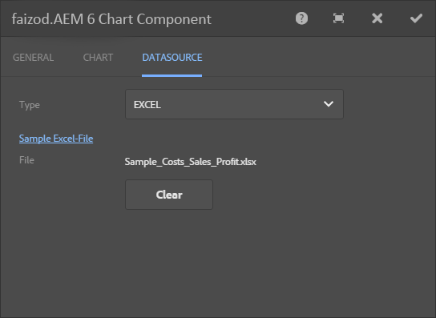
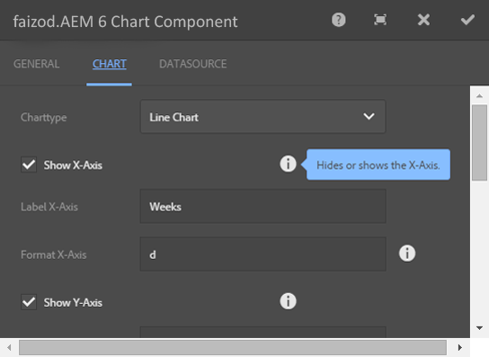
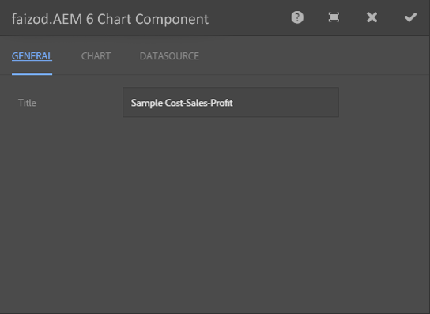
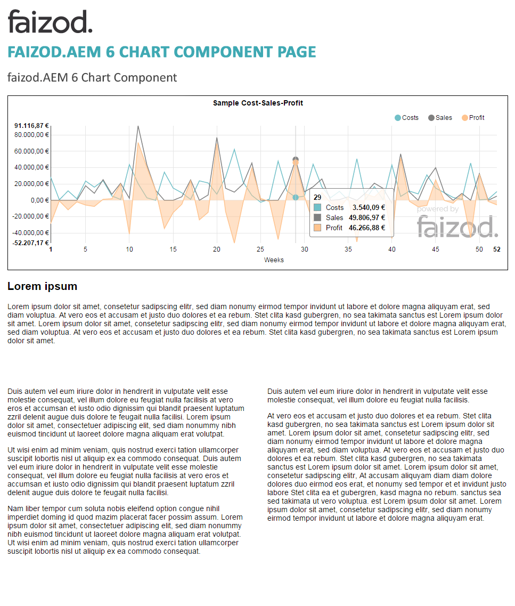
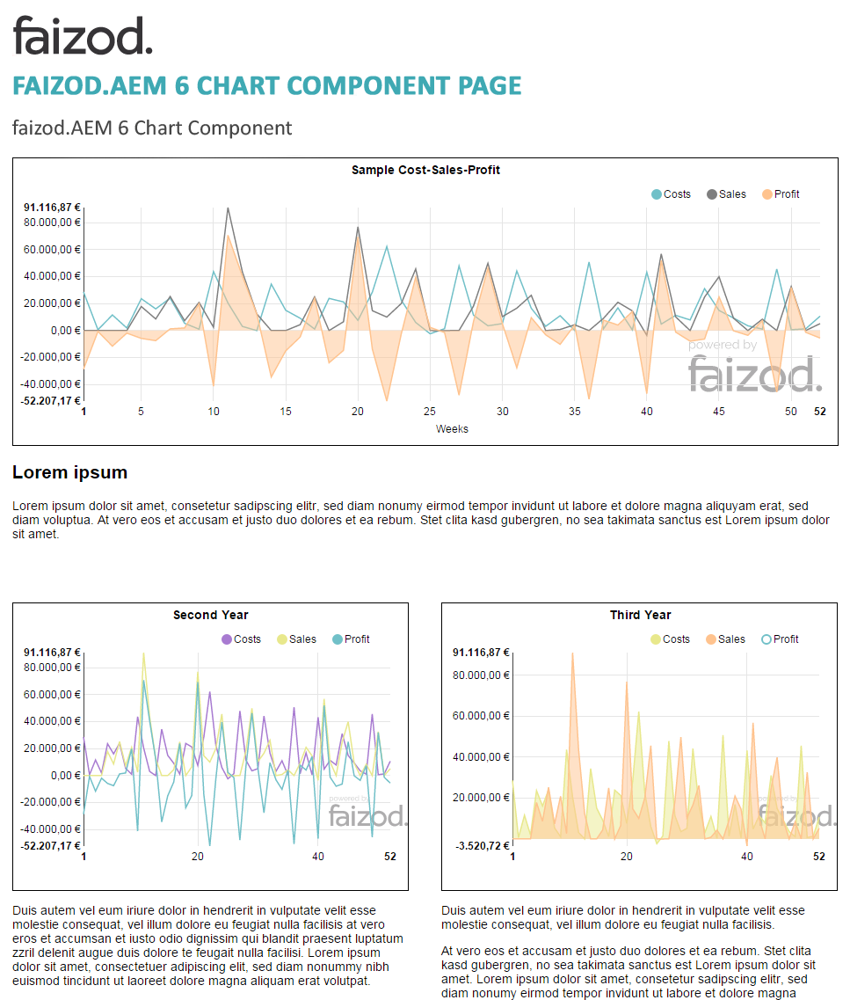
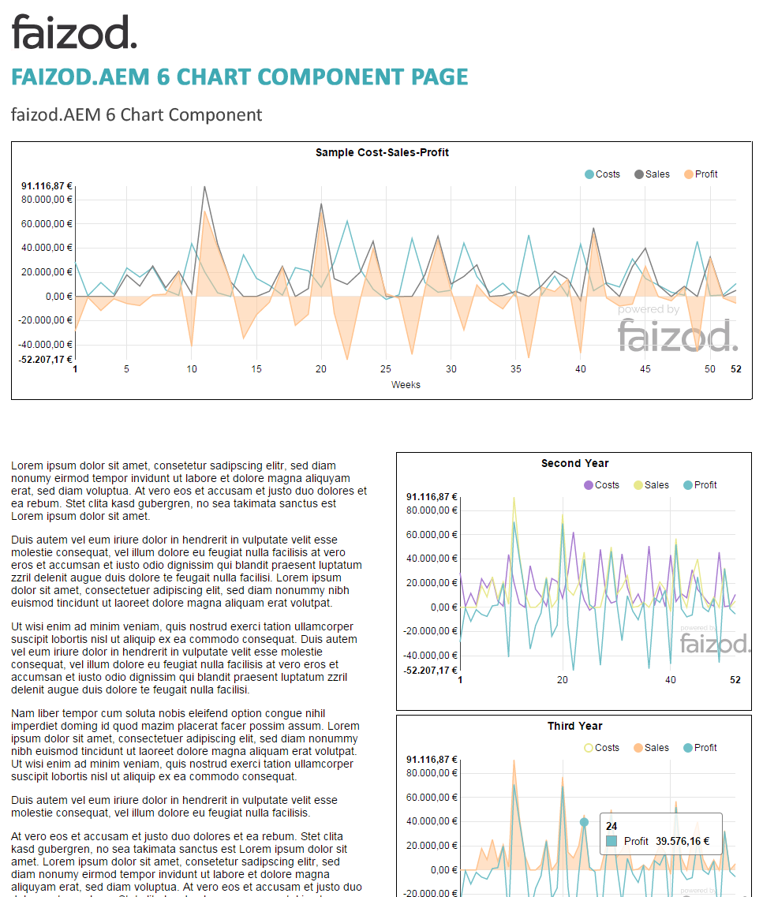
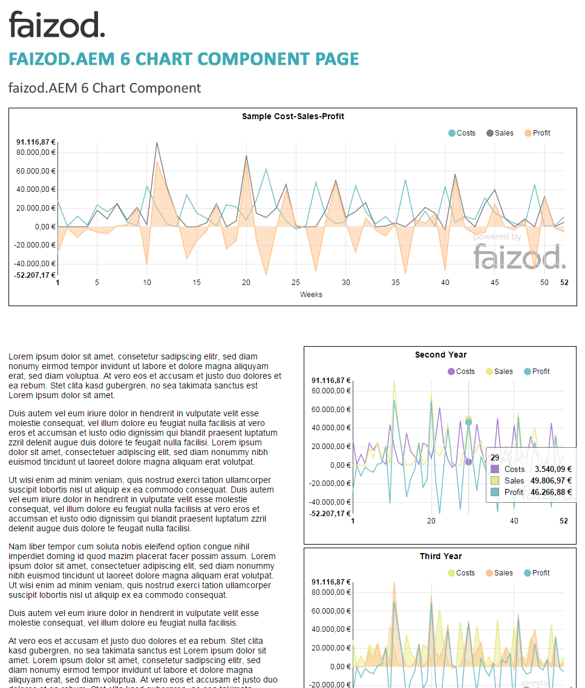

<h3 align="center">
  
</h3>


-------

faizod.AEM 6 Chart Component
============================

[](https://twitter.com/faizod)
[](https://www.facebook.com/faizod)
[](https://plus.google.com/108789949783594596562)

######*faizod.AEM 6 Chart Component* helps you to create complexe and great looking business charts in no time. It Provides a wide range of chart types which are fully configurable.

-------

<p align="center">
    <a href="#features">Features</a> &bull;
    <a href="#installation">Installation</a> &bull;
    <a href="#quick-start">Quick Start</a> &bull;
    <a href="#upcoming-features">Upcoming Features</a> &bull;
    <a href="#3rd-party-libraries">3rd Party Libraries</a> &bull;
    <a href="#license">License</a>
</p>

-------

## Features

Why wasting time creating a chart on AEM 6? Wouldn't it be easier if you can import a simple Excel file and the chart will be published considerably on AEM 6 platform?

Bring you data into Excel to easily draw charts on your AEM 6 platform.

* Import chart data from Excel files (supported formats are Excel 2007 and 2010)
* Draw chart
* Customize labels for x- and y-axis
* Each data set can be visualized and configured separately (color, labels etc.)
* Change between line chart and plane chart

## Installation

To build all the modules run in the project root directory the following command with Maven 3:

```
mvn clean install
```

If you have a running AEM instance you can build and package the whole project and deploy into AEM with

```
mvn clean install -PautoInstallPackage
```

Or to deploy it to a publish instance, run

```
mvn clean install -PautoInstallPackagePublish
```

Or to deploy only the bundle to the author, run

```
mvn clean install -PautoInstallBundle
```

## Quick Start

1. Select your data source

	* Only the first tab in the Excel file will be considered
	* First column values are x-axis
	* Each following column defines a line (y-values)
	* values of row "labels" are used as labels for the lines
	* values of row "colors" are used as color for the lines
		* Supported formats: Hex format '#000000' or RGBA format 'rgba(255,51,34,0.25)'
	* Each row has to have the same amount of values and the same length
		* No blank cells are allowed

    
    
2. Customize units and labels

     
    
3. Change title of chart
    
    
    




## Upcoming Features

1. More chart types (bar, pie)
2. Combined chart types (line chart and bar chart)
3. Different import formats (json, csv)
4. Animated charts
5. Different dialogues for customization
6. Preset color themes
7. Live chart (e. g. stock price, water level)

## 3rd Party Libraries

* [Apache POI - the Java API for Microsoft Documents, Version 3.13](https://poi.apache.org/)
* [D3.js - Data-Driven Documents](https://github.com/mbostock/d3/)
* [NVD3.js - A reusable D3 charting library](https://github.com/novus/nvd3)

## License

This project is licensed under the terms of the Apache License, Version 2.0.

See full license: [http://www.apache.org/licenses/LICENSE-2.0](http://www.apache.org/licenses/LICENSE-2.0/)